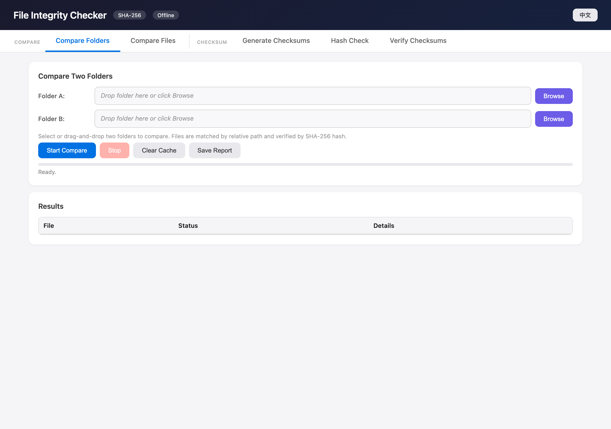

**English** | [中文](README.zh-CN.md)

# File Integrity Checker

[](LICENSE)
[](https://tongyi24.github.io/file-integrity-checker/)
[]()
[]()

**[Try it now](https://tongyi24.github.io/file-integrity-checker/)** — runs entirely in your browser, no download needed.

A portable, browser-based file integrity verification tool. Zero dependencies, zero installation, zero network requests. Just open one HTML file and verify your files.



## Why This Exists

Transferring large files between machines (Mac → Windows, NAS → laptop, cloud → local) often results in corrupted or incomplete files — especially with 4K video, raw photos, or database backups. This tool lets you verify every single byte arrived intact, without installing anything or trusting a third-party server.

## Features

| Feature | Description |
|---------|-------------|
| **Compare Folders** | Side-by-side folder comparison with SHA-256. Detects identical, modified, missing, extra, and relocated files |
| **Compare Files** | Compare two individual files byte-by-byte |
| **Generate Checksums** | Create `sha256sum`-compatible checksum files for any folder |
| **Verify Checksums** | Verify files against a previously generated checksum file |
| **Hash Check** | Verify a single file against a known SHA-256 hash value — just paste the hash and select your file |
| **Multi-language** | Chinese/English UI with auto-detection, one-click toggle, and persistent preference |
| **Flexible Matching** | Cross-machine verification that ignores directory structure differences — matches by filename or content hash |
| **Smart Caching** | Caches hashes in `localStorage`; unchanged files verify instantly on subsequent runs |
| **Streaming Hash** | Pure JavaScript SHA-256 processes files in 4MB chunks — handles multi-GB files without memory issues |

## Quick Start

### Option 1: Use Online (Recommended)

Visit **https://tongyi24.github.io/file-integrity-checker/** — that's it.

### Option 2: Use Locally

1. Download `index.html` (just one file, ~25KB)
2. Open it in any modern browser
3. Done — works completely offline

## Use Cases

- **Video / Photo Transfer** — Verify 4K footage transferred via LocalSend, AirDrop, SMB, or USB drive
- **Backup Verification** — Confirm NAS/cloud backups match originals
- **Cross-Platform Sync** — Validate files after Mac ↔ Windows ↔ Linux transfers
- **Data Migration** — Ensure database dumps, archives, or disk images transferred correctly

## Cross-Machine Workflow

When verifying files transferred between machines (e.g., Mac → Windows):

1. **Source machine**: Use the "Generate Checksums" tab → select your folder → save the `.txt` checksum file
2. **Transfer**: Copy the checksum file alongside your data (it's tiny, just text)
3. **Target machine**: Use the "Verify Checksums" tab → load the checksum file → select the target folder
4. **If directories differ**: Enable **Flexible matching** to match by filename or content hash instead of exact paths

## How It Works

```
                    ┌─────────────┐
  Select files ───▶ │  Browser    │ ──▶ Results
  (never leave      │  (local JS) │     (pass/fail)
   your machine)    └─────────────┘
                         │
                    Pure SHA-256
                    (4MB chunks)
```

- Files are read locally via the browser's File API
- SHA-256 hashing runs in pure JavaScript (no WebAssembly, no Web Crypto API dependency)
- Results stay in your browser tab — nothing is sent anywhere
- Cache uses `localStorage`, scoped to the page origin

## Privacy & Security

- **100% client-side** — All file processing happens in your browser. Nothing is uploaded to any server.
- **Zero network requests** — No `fetch`, no `XMLHttpRequest`, no tracking pixels, no analytics.
- **No third-party code** — No CDN imports, no external scripts, no fonts loaded from Google.
- **Cache isolation** — Hash cache in `localStorage` contains only hash strings, never file content.
- **Open source** — Every line of code is auditable in a single file.

## Technical Details

- **Single HTML file** — CSS + JavaScript embedded, zero build step
- **~30KB total** — Smaller than most favicons
- **SHA-256** — Hand-written streaming implementation (message schedule, compression, proper padding)
- **4MB chunked reading** — Processes multi-GB files without memory pressure
- **Three-tier flexible matching** — Path → Filename → Content hash (progressive fallback)
- **localStorage cache** — Keyed by `folderName/relativePath|fileSize|lastModified`

## Compatibility

Works on any OS with a modern browser:

| OS | Browsers |
|----|----------|
| macOS | Chrome, Safari, Edge, Firefox |
| Windows | Chrome, Edge, Firefox |
| Linux | Chrome, Firefox |

> Note: Safari has limited support for `webkitdirectory` in some versions. Chrome/Edge recommended for best experience.

## Comparison with Alternatives

| | This Tool | `shasum` CLI | HashMyFiles | Online Hash Tools |
|--|-----------|-------------|-------------|-------------------|
| Cross-platform | All | Per-OS commands | Windows only | Depends on service |
| Installation | None | System tool | Download + install | None |
| Privacy | 100% local | Local | Local | Files uploaded to server |
| Folder comparison | Built-in | Manual scripting | No | No |
| Flexible matching | Yes | No | No | No |
| Caching | Yes | No | No | No |
| GUI | Yes | No | Yes | Yes |
| Multi-language | Yes (EN/中文) | No | No | Varies |

## Contributing

Contributions welcome! Since this is a single-file project, please keep all changes within `index.html`.

## License

[MIT](LICENSE)
